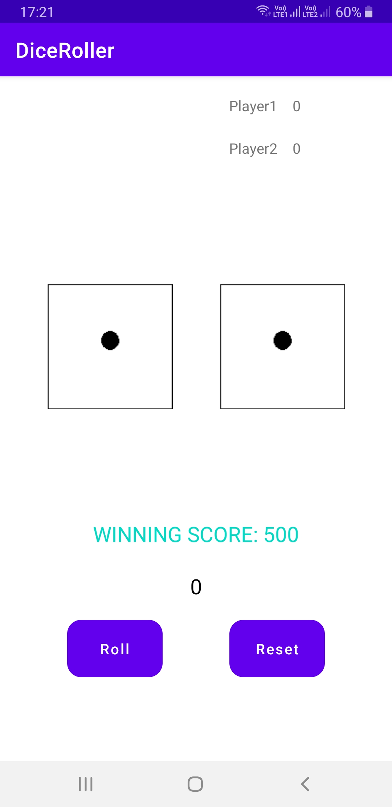
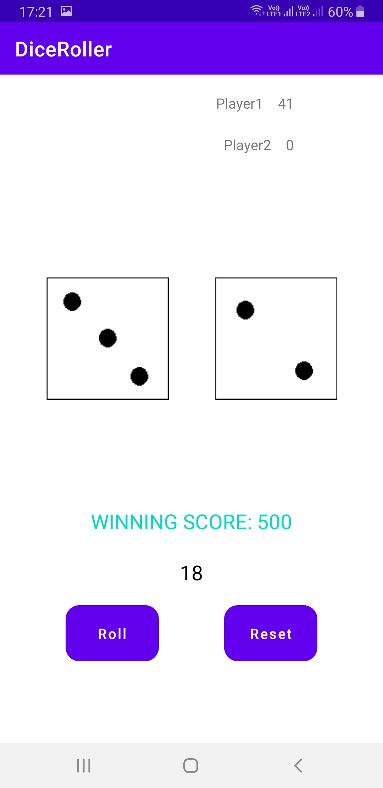
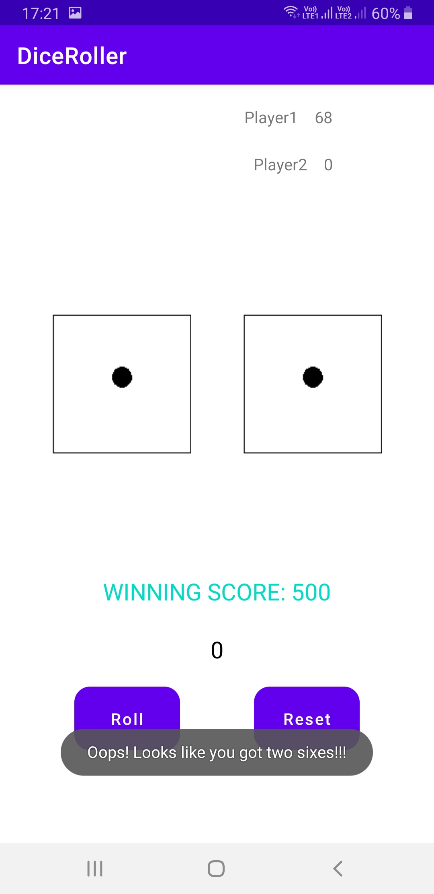
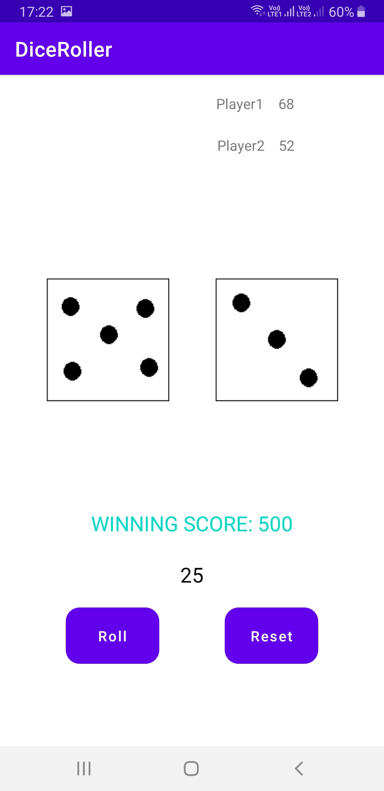
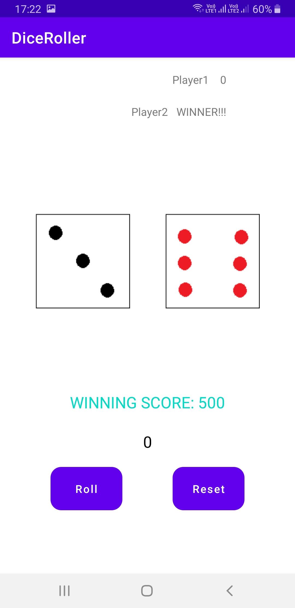
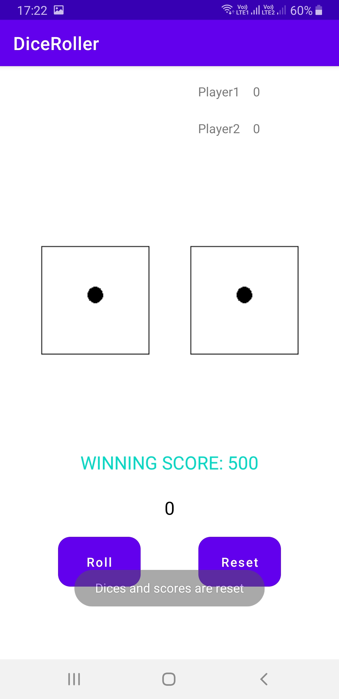

# Dice-Roller

## Check out the App by downloading the APK: [Click Here](https://play.google.com/store/apps/details?id=com.deepbarankar.diceroller)

## Description:

A simple dice roller application created in Android Studio using Java. Created using:

- Java
- Android Studio

## Game Rules:

One player will first roll the dices and the total of the numbers appearing on the dices will be added to the total score of the first player until the two sixes appear on the dices. Two sixes will give 0 points and the second player's turn will come. The second player will do the same as the first player. And this will go on until one of the players get a total of 500 points.
Click the reset button to start the game again.

